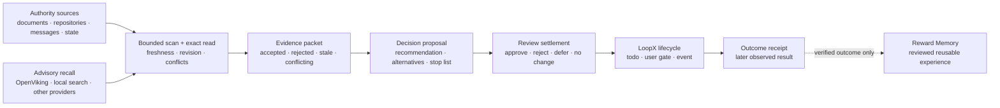

# Decision Context

[中文](README.zh-CN.md) | [Architecture contract](../../../docs/reference/protocols/decision-context-architecture-v0.md)

Status: experimental, built in, default off, goal scoped.

Decision Context helps a long-running LoopX agent rebuild **what is currently
true for one decision** before it acts. It combines revisioned authority
sources, bounded provider recall, exact reads, freshness checks, and conflict
handling into an auditable evidence packet. The agent may then produce a
proposal, while LoopX Core remains the only lifecycle and action authority.

It is useful when a goal spans days or weeks and the answer cannot safely come
from the current prompt or model memory alone.

## The Problem It Solves

A long-running agent often has more context than it can keep in one session:

- project state and source documents change independently;
- previous judgments can become stale;
- semantic recall can find useful clues but cannot prove current truth;
- recommendations are easily mistaken for facts;
- a decision is hard to improve if its later outcome is not linked back to the
  evidence that produced it.

Decision Context turns that loose context into a bounded decision cycle:



## What It Owns

Decision Context owns the decision-quality layer:

1. **Incremental source profiles** declare which source classes matter, their
   freshness policy, scan mode, and evidence weight.
2. **Bounded scan and exact read** discover changes without copying raw source
   bodies into LoopX packets.
3. **Evidence rebase** promotes current facts and explicitly records stale,
   rejected, or conflicting claims.
4. **Decision proposals** keep recommendations, alternatives, next actions,
   and stop lists separate from evidence.
5. **Review receipts** record owner `approve`, `reject`, or `defer` through the
   existing user gate, or one explicit semantic `no_change` result without a
   gate.
6. **Cursor commit** advances private source cursors after the review settlement
   and lifecycle writeback have been validated. It does not wait for a future
   real-world outcome.
7. **Outcome receipts** later link an accepted decision to observed outcomes
   and invalidated assumptions.

## What It Does Not Own

Decision Context does not:

- replace LoopX Core todo, gate, quota, event, or authority semantics;
- turn provider recall into trusted truth;
- automatically persist chat bodies, tool output, credentials, or raw provider
  payloads;
- grant permission to execute a recommendation;
- automatically activate a Reward Memory candidate;
- require OpenViking or any other single provider.

If a provider is unavailable, the capability fails open to the remaining
authority sources and records provider health. It does not block the Core
lifecycle or silently advance source cursors.

The assembly also emits `decision_source_coverage_v0`. This public-safe receipt
summarizes scan status, exact-read completeness, and uncovered P0 sources by
priority. Incomplete P0 coverage does not block safe LoopX lifecycle work, but
the caller must label the conclusion as partial or exact-read the missing
authority through another path. Fail-open must not masquerade as complete
context coverage.

## Four Auditable Outputs

| Output | Answers | Typical contents |
|---|---|---|
| `decision_evidence_packet_v0` | What should the decision trust now? | Changed facts, accepted recall, stale/rejected claims, conflicts, revisions, provider health |
| `decision_proposal_v0` | What should happen next? | Objective scores, recommendation, alternatives, actions, stop list |
| `decision_review_receipt_v0` | What did the owner decide about the proposal? | Approve/reject/defer gate evidence, or an explicit quiet no-change settlement |
| `decision_outcome_receipt_v0` | What happened after the decision? | Accepted decision, transitions, outcomes, invalidated assumptions, review time |

The evidence packet is intended to be deterministic and auditable. The
proposal is explicitly advisory. The review receipt settles whether the source
material has been consumed; it is not proof of a future outcome. The outcome
receipt is append-only evidence; only a verified outcome may later become a
Reward Memory candidate, and that candidate still follows Reward Memory review
and activation.

## Typical Uses

- Rebase a multi-week engineering or product decision against changed
  repositories, documents, and owner communication.
- Reject a previously recalled claim after an exact read shows that it is
  stale.
- Stop a planned action when the current source revision invalidates its
  premise.
- Keep a recurring decision review quiet when no material source changed.
- Provide revision-bound evidence for another capability, such as Material
  Lifecycle reranking.

This capability is not needed for a one-off answer with one stable source.

## Available Surfaces

Inspect the provider-neutral architecture:

```bash
loopx decision-context architecture --format json
```

Prove the default-off route or inspect an explicitly enabled private profile:

```bash
loopx decision-context inspect-profile \
  --goal-id <goal-id> \
  --agent-id <agent-id> \
  --format json
```

Project an enabled profile without accessing providers:

```bash
loopx decision-context source-manifest \
  --goal-id <goal-id> \
  --agent-id <agent-id> \
  --profile <ignored-private-profile.json> \
  --format json
```

Run bounded scans and exact reads without committing private cursors:

```bash
loopx decision-context prepare-evidence \
  --goal-id <goal-id> \
  --agent-id <agent-id> \
  --profile <ignored-private-profile.json> \
  --decision-id <stable-decision-id> \
  --format json
```

`prepare-evidence` is deliberately read only. A domain adapter can provide a
strict semantic rebase and persist an unapplied private checkpoint:

```bash
loopx decision-context prepare-review \
  --goal-id <goal-id> \
  --agent-id <agent-id> \
  --profile <ignored-private-profile.json> \
  --decision-id <stable-decision-id> \
  --rebase-json <ignored-private-rebase.json> \
  --pending-settlement <ignored-private-pending.json> \
  --execute \
  --format json
```

After a proposal is decided through an existing `user_gate`, settle it with
the exact gate event. The gate must use
`decision_scope=direction:action:<proposal-packet-ref>`:

```bash
loopx decision-context settle-review \
  --goal-id <goal-id> \
  --agent-id <agent-id> \
  --profile <ignored-private-profile.json> \
  --cursor-state <ignored-private-cursors.json> \
  --pending-settlement <ignored-private-pending.json> \
  --event-log <ignored-private-rollout-events.jsonl> \
  --proposal-json <public-safe-proposal.json> \
  --source-event-id <exact-user-gate-event-id> \
  --actor-ref <owner-ref> \
  --reason-code <reason-code> \
  --summary <compact-public-safe-summary> \
  --execute \
  --format json
```

For an explicit semantic `no_change`, omit `--proposal-json` and
`--source-event-id`; no user gate is created. Preview by omitting `--execute`.
These commands write only the caller-selected private pending/cursor state and
the existing local rollout event log. They grant no trading, external action,
or other irreversible authority. Removing the private profile disables the
route; removing the pending checkpoint abandons an unsettled review without
changing active cursors.

### Opt-in Source-Reference Capture

Automatic capture is **default off**. Earlier profiles rejected every
`automatic_capture=true`; it now means explicitly allowlisted **reference
capture**, not automatic semantic review, raw-content archiving, or memory sync.
Add these fields to an existing private profile's `automation` object:

```json
{
  "automatic_capture": true,
  "fail_open": true,
  "source_ids": ["source:authority:baseline"],
  "interval_seconds": 900,
  "max_pending_batches": 1000
}
```

Every listed source must already be enabled, incremental, and exact-readable.
On-demand sources are never enrolled implicitly. The same goal/agent activation
checks apply. Preview does not call providers or create the spool:

```bash
loopx decision-context capture --goal-id <goal-id> --agent-id <agent-id> \
  --profile <private-profile.json> --spool <private-capture.sqlite> \
  --cursor-state <reviewed-cursors.json> --format json
```

Add `--execute` for one tick. Use `capture-status` with the same arguments
and without `--execute` for readback. Configure a host scheduler to invoke the
tick; the capability enforces `interval_seconds`, while the host owns process
startup, an outer process timeout, and stop/uninstall. No model heartbeat is
created. Private integrations use `capture_profile_sources` from
`loopx.capabilities.decision_context.capture` with existing
`source_provider_overrides`; generic queue/configuration rules remain here.

The mode-0600 SQLite spool binds to one goal/agent and records bounded public-safe
scan receipts plus **private replay cursors**. It contains no source bodies.
Ticks are serialized; batch insertion and capture cursor advancement commit
together. Failed scans keep their cursor, and capacity exhaustion reports
`backpressure` without dropping pending batches. A changed source binding reports
`binding_changed`, requiring an explicit rebase or a separately scoped new spool.
Do not store the spool or its journal in a public repository.

Consume each source's `next_batch_id` through a fresh bounded scan and exact read:

```bash
loopx decision-context prepare-captured --goal-id <goal-id> --agent-id <agent-id> \
  --profile <private-profile.json> --spool <private-capture.sqlite> \
  --cursor-state <reviewed-cursors.json> --batch-id <batch-id> \
  --decision-id <decision-id> --rebase-json <private-rebase.json> \
  --pending-settlement <private-pending.json> --execute --format json
```

A domain host can instead use `assemble_captured_decision_evidence` with a
`rebase` callback to inspect transient exact content. Preparing evidence does
not acknowledge a batch. Use the existing `settle-review` path above; a later
capture tick retires only a prefix whose cursor already matches the supplied
**settlement-owned reviewed cursor file**. Never substitute capture cursors for
that file or manually manufacture reviewed cursors.

This is a change-reference spool, **not a lossless source archive**. First-scan
history, pagination, late edits, deletion visibility and deadlines remain provider
contracts. Providers must support deterministic bounded replay; an unavailable
captured revision raises a hold rather than reviewing substituted content. Use
an explicit current-source rebase and ordinary reviewed settlement when historical
replay is impossible. Capture health is not proof of complete decision coverage.

To stop collection, set `automatic_capture=false` and unload the host scheduler.
Existing reviewable batches remain private and can still be prepared. To roll
back to an older release, also remove the three new automation fields; retain
the spool as a private checkpoint rather than deleting unreviewed work.

## Relationship To Other Capabilities

| Capability | Primary question | Relationship |
|---|---|---|
| LoopX Core | What work is authorized and what is its lifecycle state? | Decision Context consumes Core truth and proposes through existing lifecycle contracts. |
| Reward Memory | What verified experience should be reusable later? | Decision Context may consume reviewed memory; verified outcomes may create review candidates. |
| Material Lifecycle | Which materials should be active, archived, rebuilt, or reranked? | Decision Context can supply revision-bound evidence; Material Lifecycle owns the material transition. |
| Context provider | What prior context may be relevant? | Advisory recall only; every promoted claim still needs authority and exact-read checks. |

## Maturity And Adoption Boundary

The public capability currently ships its packet contracts, default-off
activation profile, provider-neutral source contract, bounded evidence
assembly, public-safe projections, owner-gated or quiet review settlement,
private cursor commit, opt-in source-reference capture, and later validated
outcome feedback.

It is still marked **experimental**. A production integration must provide its
own private source adapters, profile, authority policy, proposal logic, and
validated lifecycle writeback. Public packets must never contain private
locators, source bodies, raw chats, provider payloads, or credentials.

For implementation details and invariants, read the
[Decision Context architecture contract](../../../docs/reference/protocols/decision-context-architecture-v0.md).

## Validate

```bash
python3 examples/decision-context-contract-smoke.py
python3 examples/decision-material-walkthrough-smoke.py
python3 -m pytest -q tests/test_decision_context_material.py
python3 -m pytest -q tests/capabilities/test_decision_context_capture.py
```

The contract smoke covers Decision Context packet and architecture readback.
The walkthrough smoke feeds revision-bound evidence into a Material Lifecycle
rerank preview, keeps stale/conflicting evidence visible, omits source bodies
and private locators, and leaves apply/cursor commits as separate owner-gated
actions.
